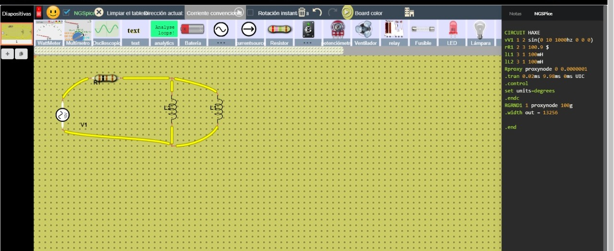
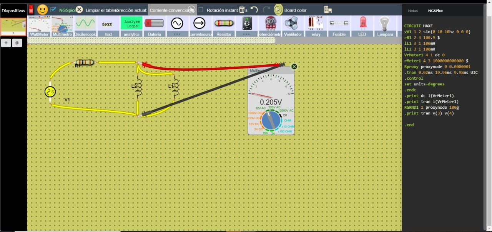

# PRÁCTICA No. 7 Inductor y Capacitor

#### Integrantes:

CALDERON VIDAL MATEO ESTEBAN

CAMACHO SIZA JOSUE EVERETT

GUEVARA CARVAJAL LUIS EDUARDO

#### NRC:

5406

## Objetivos

***Objetivo General***

- Comprender el comportamiento de los inductores y de las capacitancias en un circuito eléctrico.

***Objetivos específicos***

- Comprobar la efectividad del uso de las distintas inductancias y capacitores en el análisis de circuitos.

- Realizar comparaciones entre los datos del circuito 1 y los datos del circuito 2 adquiridos en el desarrollo de la práctica.

- Entender las conexiones y forma de uso del protoboard, del multímetro y de los demás materiales de laboratorio para hacer un uso correcto de ellos, ya que cada uno tiene una forma específica de uso.

## Marco teórico

## Explicación del procedimiento

***Material y equipo requerido***

*Tabla I. Materiales y Equipo*

***Pasos a seguir***

1)	Iniciar el simulador y seleccionar los materiales a utilizar.

2)	Preparar los materiales en el simulador: resistencia con cada valor, osciloscopio y la fuente de energía.

3)	Elaborar un circuito con los materiales con la forma indicada en la guía.

4)	Medir cada uno de los voltajes, corrientes y anotar los resultados.

5)	Construir el nuevo circuito y se tomara las mismas mediciones que el anterior.

6)	Completar las tablas respectivas con cada uno de los resultados obtenidos.

***Procedimiento***

**USANDO LA SIGUIENTE FIGURA:**

***Figura 1.***

**Armamos el circuito de la figura 1:**

**Tomamos las medidas para:**

- 0 Hz

- 10 Hz

- 50 Hz

- 100 Hz

- 500 Hz

- 1000 Hz

**Midiendo el voltaje con el Multímetro:**

- 0 Hz

- 10 Hz

- 50 Hz

- 100 Hz

- 500 Hz

- 1000 Hz

**USANDO LA SIGUIENTE FIGURA:**

Figura 2.

**Armamos el circuito de la figura 2:**

**Tomamos las medidas para:**

- 0 Hz

- 10 Hz

- 50 Hz

- 100 Hz

- 500 Hz

- 1000 Hz

**Midiendo el voltaje con el Multímetro:**

- 0 Hz

- 10 Hz

- 50 Hz

- 100 Hz

- 500 Hz

- 1000 Hz

## Resultados

*Tabla II. Resultados obtenidos con el Osciloscopio*

*Tabla III. Resultados obtenidos del voltaje con el Multímetro*

***Análisis de los resultados***

- ***¿Cómo se comportan la bobina y el capacitor en corriente continua (ceroHz)?***

- ***¿Cómo se comportan la bobina y el capacitor en corriente alterna?***

La bobina y el capacitor se oponen inmediato del voltaje y la corriente, generando un voltaje o corriente para producir dicho efecto.

- ***¿Qué cree usted que ocurriría con el voltaje  y la corriente de la resistencia en los circuitos analizados en esta práctica, si se utilizan dos bobinas o dos capacitores de valores distintos?***

- ***¿Qué son los valores eficaces de voltaje y corriente?***

Este es el valor en el que la corriente continua tendrá la misma potencia que la corriente alterna anterior.

## Video

## Conclusiones

- El osciloscopio utilizado muestra la forma de onda sinuosa de una corriente alterna y las fuentes nos permiten alternar entre voltajes pico, pico-pico y rms.

- Las bobinas y capacitores tienen la misma cantidad de inductancia y capacitancia permitiendo así conectarse en paralelo.

## Bibliografía

Gómez, A. J. (Abril de 2018). Universidad de los Andes. Obtenido de Universidad de los Andes: http://wwwprof.uniandes.edu.co/~ant-sala/cursos/FDC/Contenidos/07_Inductancia_y_Capacitancia.pdf

J. Francisco, d A. Chacon, "Medidas Eléctricas para Ingenieros," Reverte, México, 2007

Dorf, Richard C; Svoboda, James A., “Circuitos Eléctricos”, Novena edición, 2015.

